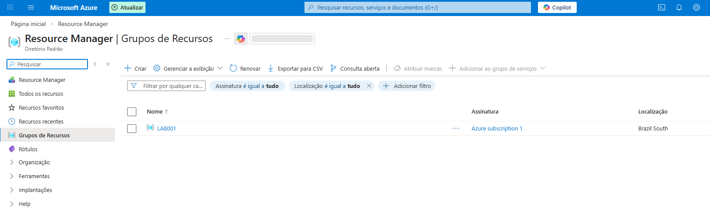
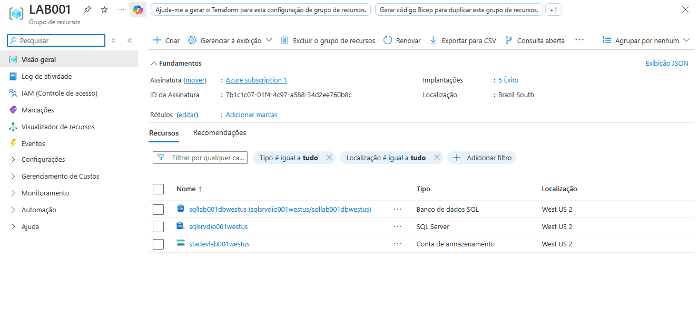
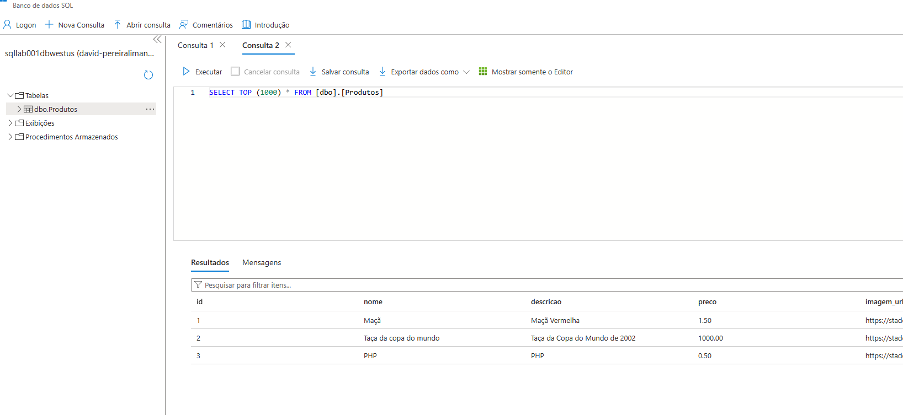
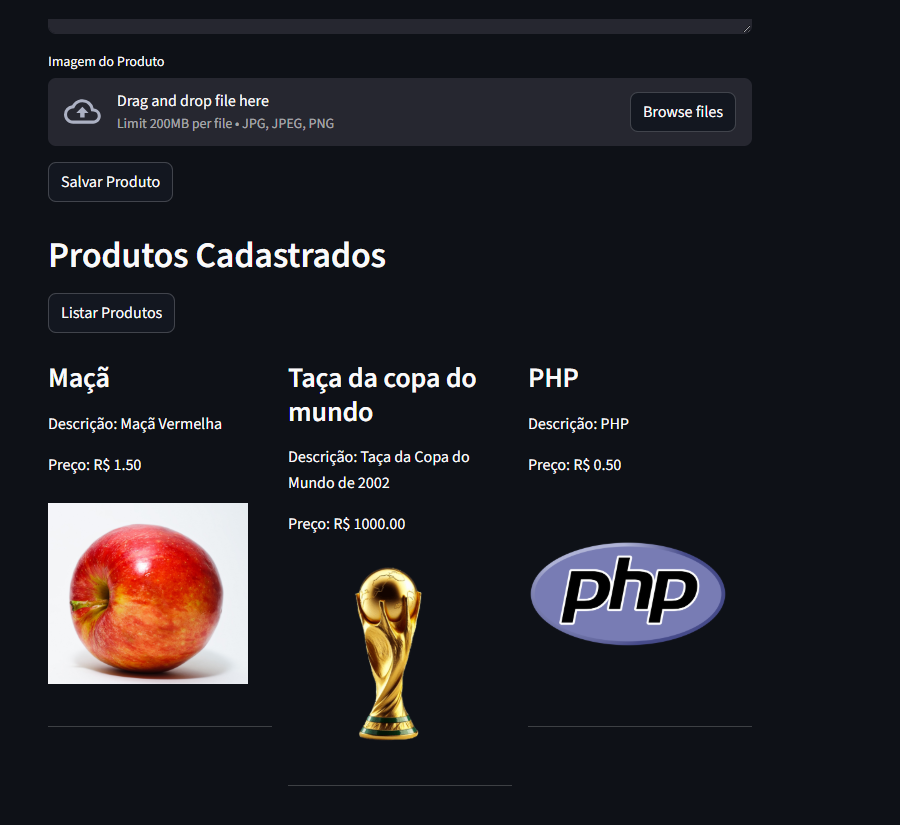

# 🛒 DIO — Armazenando Dados de um E-Commerce na Cloud

<p align="center">
  
  
  
  
</p>

Projeto do bootcamp **Microsoft Application Platform** da [DIO](https://www.dio.me/). O foco é o armazenamento e gerenciamento de dados de um E-Commerce utilizando serviços PaaS da Microsoft Azure.

---

## 📋 Sobre o Projeto

O objetivo deste projeto é construir uma aplicação web ágil de **Cadastro e Listagem de Produtos** utilizando **Python** e **Streamlit**, onde:
- As **imagens dos produtos** (dados não estruturados) são armazenadas no **Azure Blob Storage**.
- Os **dados do produto** (nome, descrição, preço e URL da imagem) são salvos no **Azure SQL Database**.

---

## 🚀 Processo de Desenvolvimento e Infraestrutura

A infraestrutura foi criada diretamente no portal do Microsoft Azure, agrupada no Resource Group `LAB001`:
1. **Grupo de Recursos (`LAB001`)**: Contêiner lógico para os recursos.
2. **Conta de Armazenamento (`stadevlab001westus`)**: Utilizada para criar o contêiner Blob público chamado `fotos`.
3. **Servidor SQL e Banco de Dados (`sqlsrvdio001westus` / `sqllab001dbwestus`)**: Provisionamento do banco relacional, incluindo a liberação de IP no firewall para permitir a conexão via script Python.

A aplicação foi feita utilizando a biblioteca `pymssql` para interagir com o Azure SQL e `azure-storage-blob` para envio das imagens.

---

## 💡 Insights e Aprendizados

- **Separação de Dados**: Armazenar os arquivos de imagem no Banco de Dados SQL é ineficiente e caro. O uso do **Azure Blob Storage** para as imagens e salvar apenas a `URL` pública no banco relacional é a melhor prática de arquitetura.
- **Segurança**: Credenciais de acesso e Connection Strings nunca devem ficar fixas no código. O uso do pacote `python-dotenv` (arquivo `.env`) garante que segredos não vazem em repositórios de código.
- **SQL como PaaS**: Utilizar o Azure SQL Database tira a sobrecarga de gerenciar infraestrutura operacional (VMs, atualizações do SO, backups), permitindo focar diretamente na modelagem da tabela (`dbo.Produtos`) e nas queries.
- **Streamlit**: É uma ferramenta poderosa para criar interfaces web baseadas em Python rapidamente, abstraindo a complexidade do HTML/CSS e requisições HTTP do frontend tradicional.

---

## 📸 Screenshots do Projeto 
*(Substitua os caminhos das imagens pelos arquivos gerados)*

### 1. Interface da Aplicação Web (Streamlit)
> Exibição da funcionalidade de listar produtos, recuperando dados do SQL e as imagens nativamente do Blob Storage.



### 2. Azure Portal — Banco de Dados SQL (Query)
> Consulta ao banco de dados rodando diretamente no portal do Azure validando a inserção correta dos registros.



### 3. Azure Portal — Recursos Utilizados
> Visão geral dos componentes criados dentro do grupo de recursos `LAB001`.



### 4. Azure Portal — Grupo de Recursos
> Organização lógica utilizada na nuvem.



---

## 🛠️ Como Executar Localmente

```bash
# Instale as dependências fornecidas no arquivo requirements.txt
pip install -r requirements.txt

# Crie um arquivo .env na raiz do projeto contendo as seguintes variáveis com suas credenciais do Azure:
# BLOB_CONNECTION_STRING, BLOB_CANTAINER_NAME, BLOB_ACCOUNT_NAME
# SQL_SERVER, SQL_DATABASE, SQL_USER, SQL_PASSWORD

# Execute a aplicação
streamlit run main.py
```